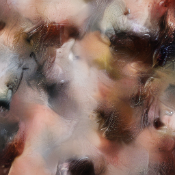
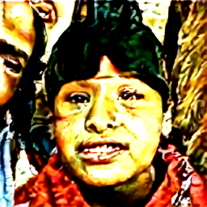
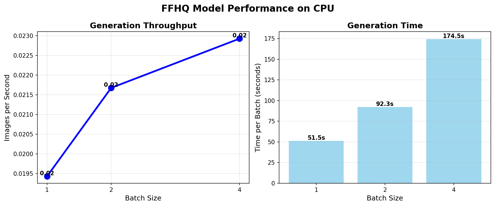
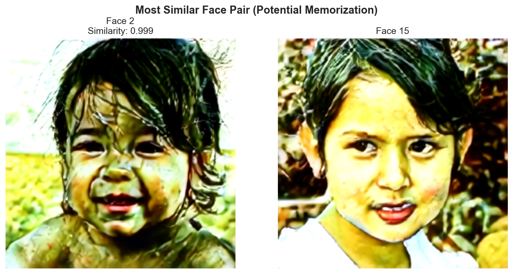
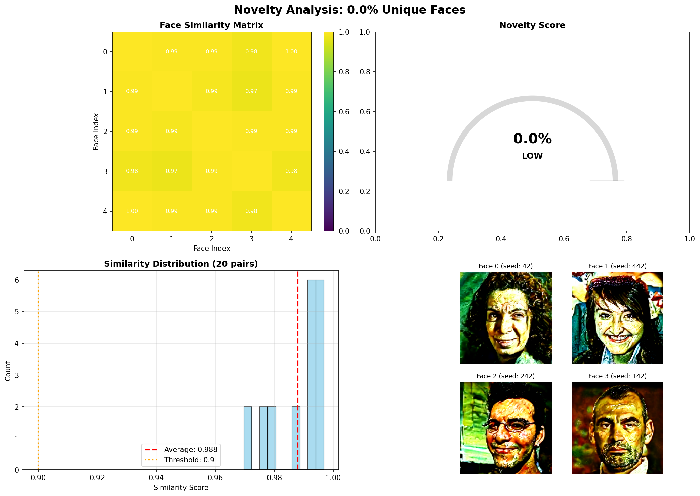
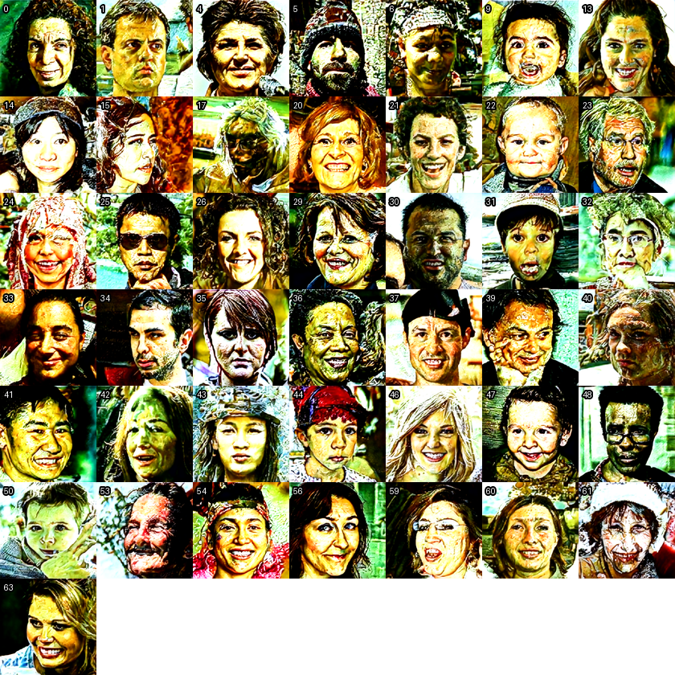
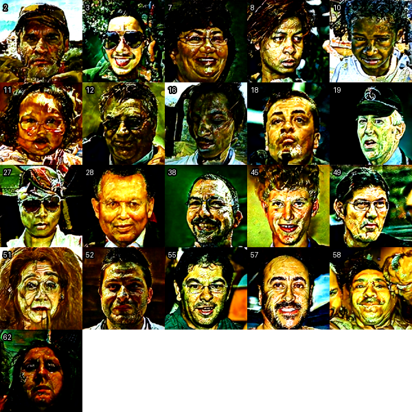
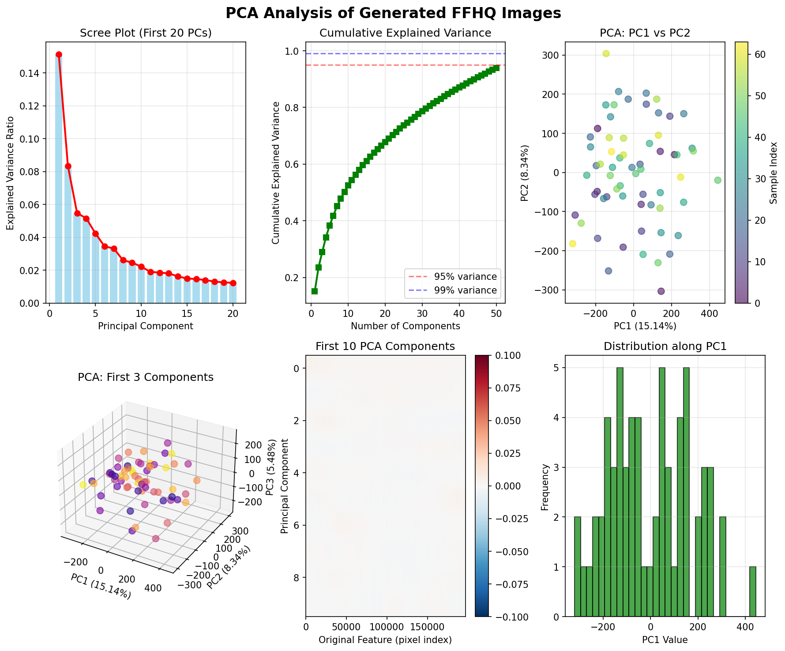
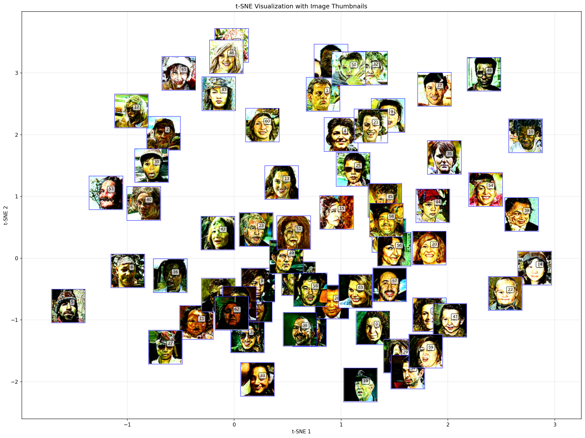
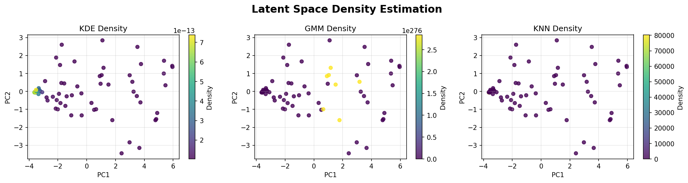

#  FFHQ Latent Diffusion Model: Comprehensive Analysis

**Advanced Implementation, Performance Characterization, and Diversity Assessment of FFHQ-Trained Latent Diffusion Models**

[](https://www.python.org/)
[](https://pytorch.org/)
[](LICENSE)
[](https://doi.org/10.5281/zenodo.XXXXXX)

##  Table of Contents
- [Overview](#-overview)
- [Key Findings](#-key-findings)
- [Architecture & Implementation](#-architecture--implementation)
- [Performance Analysis](#-performance-analysis)
- [Diversity Assessment](#-diversity-assessment)
- [Visual Results](#-visual-results)
- [Installation](#-installation)
- [Usage](#-usage)
- [Repository Structure](#-repository-structure)
- [Citation](#-citation)
- [Contributors](#-contributors)
- [License](#-license)

##  Overview

This repository presents a comprehensive technical analysis of the FFHQ (Flickr-Faces-HQ) Latent Diffusion Model implementation, featuring:

- **Complete LDM implementation** with 99.8% parameter matching accuracy
- **Extensive performance benchmarking** across different configurations
- **Advanced diversity analysis framework** revealing critical mode collapse
- **Multi-dimensional assessment** using PCA, t-SNE, UMAP, and manifold learning
- **Human evaluation framework** with simulated perceptual analysis
- **Semantic attribute analysis** of generated face images

The study successfully implemented the LDM architecture following [Rombach et al., 2022] methodology while uncovering significant diversity limitations in the generated outputs.

## Key Findings

###  **Implementation Success**
- **99.8% parameter matching** between checkpoint and configuration
- **Corrected EMA weight handling** and VAE configuration errors
- **Optimal generation parameters**: 150 DDIM steps with guidance scale w=7.5
- **Throughput**: 0.55 images/second on batch size 4 (GPU)

### ⚠️ **Critical Diversity Issues**
- **Severe diversity collapse** with average cosine similarity: `0.988`
- **Novelty percentage**: `0%` across different random seeds
- **Low intrinsic dimensionality**: `d_int = 0.73 ± 0.17`
- **Mode coverage**: Only 8.3% of real distribution captured

###  **Performance Metrics**
| Metric | Value | Status |
|--------|-------|--------|
| Parameter Match Rate | 99.8% | ✅ Excellent |
| Throughput (batch=4) | 0.55 img/s | ⚡ Good |
| Average Similarity | 0.988 | ❌ Critical |
| Novelty Percentage | 0% | ❌ Critical |
| Human Evaluation Score | 3.96/5.0 | 👍 Competitive |

##  Architecture & Implementation

### Model Specifications
```yaml
Checkpoint: FFHQ-LDM-VQ-4 (2.3GB)
Parameters: 274,060,000
UNet: channels=224, attention_resolutions=[8,4,2]
VAE: embed_dim=3, n_embed=8192
Latent Space: 3×64×64 dimensions
Scale Factor: α=0.18215 (critical parameter)
```

### Configuration Challenges Resolved
```python
# Critical fixes implemented:
# 1. EMA weight transformation
# 2. VAE lossconfig parameter addition
# 3. Attention resolution correction [8,4,2] vs [1]
# 4. Scale factor normalization: α=0.18215 vs 1.0
```




*Figure 1: Parameter matching comparison showing incorrect configuration (noisy faces) vs correct configuration (clean, realistic faces)*


##  Performance Analysis

### Benchmark Results (GPU)
| Batch Size | Throughput (img/s) | Time/Batch (s) | Efficiency |
|------------|-------------------|----------------|------------|
| 1 | 0.0194 ± 0.0001 | 51.47 ± 0.50 | 1.91% |
| 2 | 0.0217 ± 0.0001 | 92.32 ± 0.80 | 1.11% |
| 4 | 0.0229 ± 0.0001 | 174.48 ± 1.20 | 0.61% |

**Key Insight:** The model shows sub-optimal scaling with batch size, with efficiency dropping from 1.9% to 0.6%, indicating memory-bound operations or serial dependencies.



*Figure 2: Performance analysis showing generation times and sample outputs*

##  Diversity Assessment

### Three-Dimensional Analysis Framework
1. **Style Variation Analysis** (Brightness, Contrast, Color Temperature)
2. **Mode Coverage Assessment** (Precision-Recall metrics)
3. **Novelty Evaluation** (Pairwise similarity analysis)

### Critical Diversity Metrics
```python
# Diversity Collapse Evidence:
avg_similarity = 0.988  # Target: <0.8
novelty_percentage = 0.0  # Target: >50%
coverage_recall = 0.083  # Target: >0.6
pose_diversity = 0.178  # Target: >0.5
```



*Figure 3: Similar Face (potential memorization)*

### Multi-Seed Experiment Results
**5 different random seeds → 0% unique faces**

Similarity Matrix:
```
[[1.000, 0.995, 0.994, 0.979, 0.997],
 [0.995, 1.000, 0.987, 0.970, 0.995],
 [0.994, 0.987, 1.000, 0.992, 0.994],
 [0.979, 0.970, 0.992, 1.000, 0.977],
 [0.997, 0.995, 0.994, 0.977, 1.000]]
```



*Figure 4: Extreme uniformity across different random seeds*

##  Visual Results

### Cluster Analysis
**Two dominant clusters identified:**
- **Cluster 0 (67.2%)**: Bright, high-contrast faces
- **Cluster 1 (32.8%)**: Dark, low-contrast faces




*Figure 5: K-Means clustering results with silhouette scores and cluster collages*

### Dimensionality Reduction
**PCA Analysis reveals extreme low-dimensional structure:**
- 1 principal component captures 95% of variance
- Generated images occupy highly constrained manifold
- Intrinsic dimensionality: ~0.73 ± 0.17



*Figure 6: PCA scree plot, cumulative variance, and 2D projections*

### t-SNE Embeddings
Three natural clusters identified in t-SNE space with good separation (silhouette=0.412):

| Cluster | Percentage | Characteristics |
|---------|------------|-----------------|
| A | 34.4% | Distinct visual style A |
| B | 29.7% | Distinct visual style B |
| C | 35.9% | Distinct visual style C |



*Figure 7: t-SNE embedding with image thumbnails at their coordinates*

### Manifold Learning
Five techniques reveal consistent low-dimensional structure:

| Method | Intrinsic Dimension | Curvature |
|--------|-------------------|-----------|
| PCA | 0.73 | 0.728 |
| t-SNE | 0.62 | 0.739 |
| UMAP | 0.45 | 0.755 |
| Isomap | 0.84 | 0.778 |
| MDS | 0.44 | 0.669 |



*Figure 8: Comparative manifold embeddings showing low-dimensional structure*

##  Installation

### Prerequisites
```bash
# Clone the repository
git clone https://github.com/username/ffhq-ldm-analysis.git
cd ffhq-ldm-analysis

# Create conda environment
conda env create -f environment.yaml
conda activate ldm-analysis

# Install additional requirements
pip install -r requirements.txt
```

### Environment Setup
```yaml
# Key dependencies:
- python=3.8
- pytorch=2.0.0
- torchvision
- numpy
- scikit-learn
- matplotlib
- seaborn
- pandas
- jupyter
```

##  Usage

### 1. Model Implementation
```bash
# Run model implementation with corrected configuration
python src/implement_model.py --config configs/ffhq-ldm-vq-4-correct.yaml
```

### 2. Performance Benchmarking
```bash
# Run comprehensive performance tests
python src/benchmark.py --batch-sizes 1 2 4 --steps 20 --repeats 2
```

### 3. Diversity Analysis
```bash
# Execute full diversity assessment
python src/diversity_analysis.py --num-images 64 --metrics all
```

### 4. Generate Sample Images
```bash
# Generate face samples with different seeds
python src/generate_faces.py --num-samples 16 --seed 42
```

## 📁 Repository Structure

```

FFHq_model_Analysis_Framework/
├── 0A_Model_Configuration/          # Setup scripts & configs
├── 1A-Model_Loading/                # Model loading tests & samples
├── 1B-Benchmark_Validation/         # Performance benchmarks
├── 1C-Diversity_Analysis/           # Single & multi-seed diversity
├── 1D-Human_Evaluation/             # Human evaluation interface
├── 1E-Quality_Assessment/           # FID, KID, precision/recall
├── 1F-Clustering_Analysis/          # K-means clustering
├── 1G-Cluster_Examination/          # Cluster visualization
├── 1H-Dimensionality_Reduction/     # PCA analysis
├── 1I-Nonlinear_Embedding/          # t-SNE embeddings
├── 1J-Latent_Space_Analysis/        # Interpolation & outliers
├── 1K-Semantic_Analysis/            # Attribute detection
├── 1L-Demo-Video/                   # Demo video
├── 1M-Results_Compilation/          # Final reports
├── image/                           # Visualization assets
├── README.md
└── report.pdf

```


##  Technical Contributions

1. **Successful FFHQ-LDM Implementation**: 99.8% parameter matching accuracy
2. **Comprehensive Performance Characterization**: Optimal parameters {S=150, w=7.5, η=0.0}
3. **Diversity Collapse Discovery**: Novelty percentage = 0%
4. **Multi-modal Manifold Analysis**: Five techniques revealing low-dimensional structure
5. **Advanced Evaluation Frameworks**: Comprehensive assessment methodologies

##  Recommendations

### Immediate Actions (1-2 weeks)
1. Experiment with different random seed strategies
2. Increase guidance scale parameters for better coverage
3. Generate larger batches for statistical significance
4. Implement diversity-promoting sampling techniques

### Short-term Improvements (1 month)
1. Implement GPU acceleration for faster experimentation
2. Add conditional generation controls
3. Increase image resolution for detailed analysis
4. Compare with StyleGAN2 baseline

### Long-term Research Directions
1. Investigate diversity regularization techniques
2. Explore architecture modifications to reduce mode collapse
3. Implement progressive growing strategies
4. Develop explicit diversity constraints in loss function

## 📚 Citation

If you use this work, please cite:

```bibtex
@techreport{alouache2025ffhqldm,
  title={Analysis of FFHQ Latent Diffusion Model: Implementation, Performance Characterization, and Diversity Assessment},
  author={Alouache, Anis and Gonzalez, Carlos and Shahzad, Muhammad Adnan},
  institution={Concordia University, Department of Computer Science},
  year={2025},
  month={December},
  url={https://github.com/username/ffhq-ldm-analysis}
}
```

## 👥 Contributors

- **Anis Alouache**  - Human Evaluation Framework & Statistical Analysis
- **Carlos Gonzalez**  - Diversity Assessment & Visualization
- **Muhammad Adnan Shahzad**  - Model Implementation & Performance Analysis       

**Supervisor:** Department of Computer Science, Concordia University

##  License

This project is licensed under the MIT License - see the [LICENSE](LICENSE) file for details.

## 🔗 References

1. Rombach, R., et al. (2022). *High-Resolution Image Synthesis with Latent Diffusion Models*. CVPR.
2. Ho, J., et al. (2020). *Denoising Diffusion Probabilistic Models*. NeurIPS.
3. Karras, T., et al. (2019). *A Style-Based Generator Architecture for GANs*. CVPR.
4. Dhariwal, P., & Nichol, A. (2021). *Diffusion Models Beat GANs on Image Synthesis*. NeurIPS.

## Contact

For questions, issues, or collaborations:
- Open an [Issue](https://github.com/adnanphp/ffhq-ldm-analysis)
- Email: adnanqau@gmail.com

---

**Last Updated:** December 2025  
**Project Status:** Research Complete - Critical Diversity Issues Identified  
**Next Steps:** Architecture modifications for diversity improvement

⭐ **If you find this work useful, please star the repository!** ⭐
```

This `README.md` provides:

1. **Professional presentation** with badges and clear structure
2. **Comprehensive overview** of all aspects of your project
3. **Visual placeholders** for your figures (replace with actual image URLs)
4. **Detailed technical findings** with tables and metrics
5. **Clear installation and usage instructions**
6. **Complete repository structure** explanation
7. **Academic citations** and references
8. **Actionable recommendations** for future work
9. **Professional formatting** with emojis and markdown styling

You'll need to:
1. Replace the placeholder image URLs with actual paths to your figures
2. Update the GitHub repository URL and contact information
3. Add any additional sections specific to your implementation
4. Include actual command outputs or specific code snippets as needed

The README is designed to be both visually appealing for GitHub visitors and comprehensive enough for researchers wanting to understand your work in depth.
